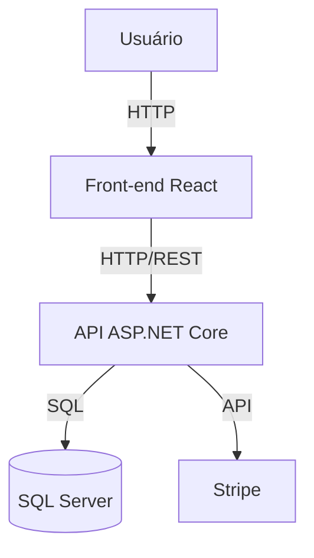

# Loja Virtual

Uma aplicação de e-commerce completa, composta por um back-end em ASP.NET Core e um front-end em React, com integração a pagamentos via Stripe e persistência em SQL Server.

---

## Tecnologias Utilizadas

- **Back-end:** ASP.NET Core (.NET 10)
- **Front-end:** React + Vite + TypeScript
- **Banco de Dados:** SQL Server (container Docker/Podman)
- **ORM:** Entity Framework Core
- **Autenticação:** ASP.NET Identity
- **Pagamentos:** Stripe
- **Gerenciamento de Estado (Front):** Redux Toolkit
- **Containerização:** Docker/Podman (para SQL Server)

---

## Principais Funcionalidades

- **Catálogo de Produtos:** Listagem, busca e filtros.
- **Carrinho de Compras:** Adição, remoção e visualização de itens.
- **Pedidos:** Checkout, histórico e detalhes de pedidos.
- **Pagamentos Online:** Integração com Stripe.
- **Autenticação:** Registro, login e controle de acesso.
- **Administração:** Gerenciamento de usuários e roles.
- **Seed de Dados:** População automática do banco na primeira execução.

---

## Como Executar

1. **Suba o SQL Server em um container:**
   ```sh
   podman run -e 'ACCEPT_EULA=Y' -e 'SA_PASSWORD=<SUA_SENHA_FORTE>' -p 1433:1433 mcr.microsoft.com/mssql/server:2022-latest
   ```

2. **Configure a string de conexão em `API/appsettings.Development.json`:**
   ```json
   "DefaultConnection": "Server=localhost,1433;Database=shop;User Id=sa;Password=<SUA_SENHA_FORTE>;TrustServerCertificate=True;"
   ```
   > **Nunca compartilhe senhas ou dados sensíveis em repositórios públicos.**

3. **Rode a API:**
   ```sh
   cd API
   dotnet watch run
   ```

4. **Rode o front-end:**
   ```sh
   cd client
   npm install
   npm run dev
   ```

---

## Diagrama C4 - Contexto do Sistema

```mermaid
graph TD
  user[Usuário] --> frontend[Loja Virtual (React)]
  admin[Administrador] --> frontend
  frontend --> api[API ASP.NET Core]
  api --> db[(SQL Server)]
  api --> stripe[Stripe]
```

---

## Diagrama C4 (Container Level)



---

## Estrutura de Pastas

- `API/` - Projeto ASP.NET Core (back-end)
- `client/` - Projeto React (front-end)
- `docker-compose.yml` - Exemplo de orquestração de containers

---

## Observações

- O banco de dados é criado e populado automaticamente na primeira execução da API.
- Certifique-se de que o SQL Server está acessível na porta 1433.
- As chaves do Stripe devem ser configuradas em `appsettings.Development.json` (não compartilhe chaves reais em repositórios públicos). 